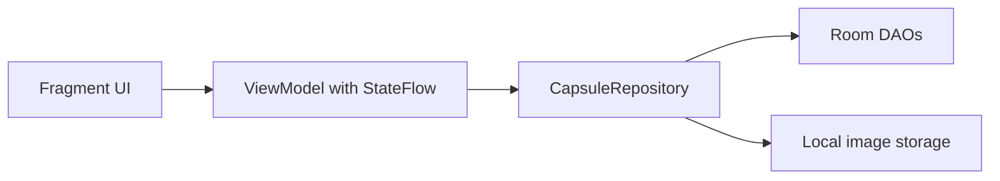

# Day 8 MVVM Wiring Notes

## What Changed

Day 8 moved the active capsule flows away from fragment-owned database work and into a simple MVVM structure.

The main flow is now:

## Current Screen Ownership

- `CreateTextCapsuleFragment` renders create state, launches image pick/camera intents, and forwards user actions to `CreateTextCapsuleViewModel`.
- `PersonalArchiveFragment` renders the archive list from `PersonalArchiveViewModel`.
- `CapsuleDetailFragment` renders detail/edit/delete state from `CapsuleDetailViewModel`.
- `CapsuleRepository` owns Room access, seed-user writes, capsule CRUD, and local image import/delete behavior.

## Why This Matters For The Report

This gives the project a clearer separation of concerns:

- fragments handle UI rendering and navigation
- ViewModels expose state with `StateFlow` and events with `SharedFlow`
- repository code mediates persistence and local file work
- Room remains the local source of truth

This is the architecture evidence for the Day 8 checkpoint.
